> [!NOTE]
> **Archived.** This repo is part of [Cortex](https://github.com/cortex-io), which is no longer under active development. It is kept as a working record: explore, fork and borrow freely, but no fixes or features are planned.

<a href="https://github.com/cortex-io"><b>Cortex</b></a> &nbsp;·&nbsp; <a href="https://github.com/cortex-io/cortex">cortex</a> · <a href="https://github.com/cortex-io/cortex-platform">cortex-platform</a> · <a href="https://github.com/cortex-io/cortex-gitops">cortex-gitops</a> · <b>cortex-k3s</b> · <a href="https://github.com/cortex-io/cortex-docs">cortex-docs</a> · <a href="https://github.com/cortex-io/cortex-construction-hq">cortex-construction-hq</a> · <a href="https://github.com/cortex-io/infrastructure-docs">infrastructure-docs</a>

## The Idea

Deploy a generalist AI stack. Operate it on real tasks. Collect telemetry. Distill the operational knowledge into a specialized model. Graduate from orchestration to a single expert.

**Infrastructure as training data.**

## Architecture

## Components

| Component | Role |
|-----------|------|
| MoE Router | Routes queries to the right model/tool |
| Qdrant | Vector storage for domain knowledge |
| MCP Server | Tool execution |
| Telemetry Collector | Captures routing decisions, queries, tool calls |
| Distillation Pipeline | Trains LoRA adapters from collected data |

## Features

- **Scale-to-zero** — all components idle to zero via KEDA
- **Burst-capable** — scales up on demand
- **Telemetry-driven distillation** — CronJob pipeline: collect → filter → fine-tune → publish
- **Output formats** — LoRA, full fine-tune, or GGUF

## Pre-configured Layers

`infrastructure-layer` · `security-layer` · `networking-layer`

---

Part of the <a href="https://github.com/cortex-io">Cortex archive</a> · built with Claude

