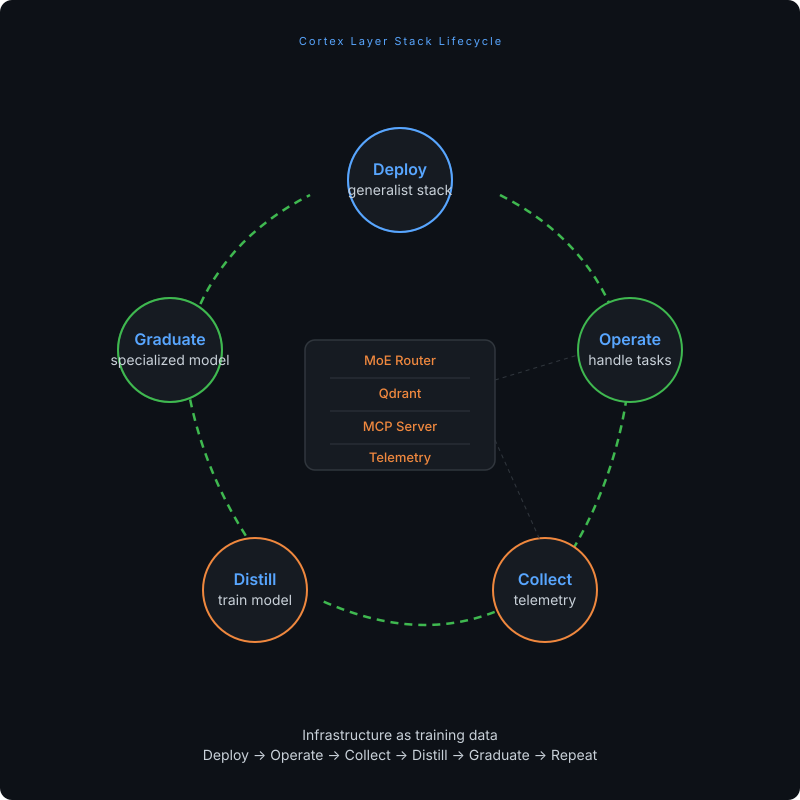

# Cortex Layer Stack

**Helm chart for deploying self-contained, burst-capable AI service stacks that evolve into specialized models.**

> ⚠️ **This project is archived.** No longer under active development.

---

## The Idea

Deploy a generalist AI stack. Operate it on real tasks. Collect telemetry. Distill the operational knowledge into a specialized model. Graduate from orchestration to a single expert.

**Infrastructure as training data.**

## Architecture

## Components

| Component | Role |
|-----------|------|
| MoE Router | Routes queries to the right model/tool |
| Qdrant | Vector storage for domain knowledge |
| MCP Server | Tool execution |
| Telemetry Collector | Captures routing decisions, queries, tool calls |
| Distillation Pipeline | Trains LoRA adapters from collected data |

## Features

- **Scale-to-zero** — all components idle to zero via KEDA
- **Burst-capable** — scales up on demand
- **Telemetry-driven distillation** — CronJob pipeline: collect → filter → fine-tune → publish
- **Output formats** — LoRA, full fine-tune, or GGUF

## Pre-configured Layers

`infrastructure-layer` · `security-layer` · `networking-layer`

---

Built with Claude. No longer maintained.

